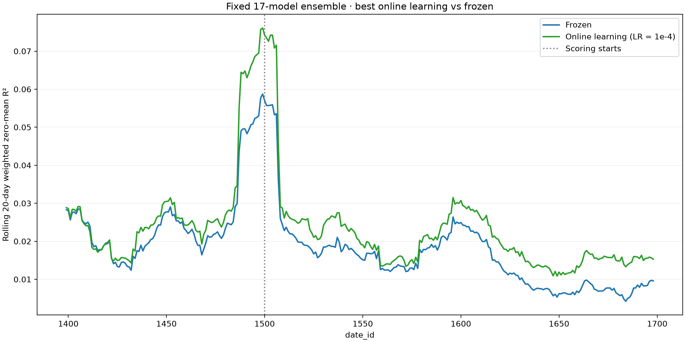

# Jane Street Causal Forecasting

A leakage-safe research harness for reconstructing **Patrick Yam's second-place
Jane Street Real-Time Market Data Forecasting method**. It implements training-only
preprocessing, asset attention with temporal GRUs, delayed online updates, seed
ensembles, and local evaluation through the competition's information flow.

**Correctness comes before experiments:** every CLI training/ablation run first
executes metric, protocol, and causal tests. This is an independent reconstruction,
not the author's submission code or a verified reproduction of his leaderboard score.
The [implementation decisions](docs/patrick-implementation.md) and
[source tracker](docs/patrick-yam-tracker.md) distinguish recovered settings from assumptions.

## Current Patrick results

The working baseline is **five offline epochs and online LR `1e-4`**, with three
daily Adam steps, betas `(0.8, 0.95)`, persistent online optimizer state, and all nine
responder targets. Offline training LR remains `5e-4`. Online updates use only
previous-day labels after their API release.

Completed experiments report pooled weighted zero-mean R²:

| Experiment | Seeds | Scored dates | Frozen R² | Online R² at `1e-4` |
|---|---:|---|---:|---:|
| Development, 3 offline epochs | 3 | 1180–1379 | 0.01818019 | 0.02193983 |
| Development, 4 offline epochs | 3 | 1180–1379 | 0.01893456 | 0.02308571 |
| Development, 5 offline epochs | 3 | 1180–1379 | 0.01935094 | 0.02405157 |
| Later follow-up, 5 offline epochs | 17 | 1500–1698 | 0.01412888 | 0.01941540 |

Development models train on dates 0–1059 and replay unscored warmup 1060–1179.
The 17-model ensemble trains on 0–1379 and replays unscored warmup 1380–1499.
Scores from these different windows are not directly comparable.



Our reproduction of the online-versus-frozen comparison uses the same initial
17-model ensemble for both curves. Online LR `1e-4` is the best tested setting for
this ensemble. The curves show rolling 20-day weighted zero-mean R²; the dotted
line marks scoring starting at date 1500 after unscored warmup. Over dates
1500–1698, pooled R² is **0.01941540 online versus 0.01412888 frozen**.
See the [full experiment record](docs/patrick-online-followup.md).

The [completed epoch study](docs/patrick-epoch-study.md) favors five epochs among
the three tested budgets. The [learning-rate refinement](docs/patrick-online-refinement.md)
found `5e-5` narrowly ahead of `1e-4` on the development window (0.02406497 versus
0.02405157); this does not establish a precise optimum. Only `1e-4` has the
[completed 17-model follow-up](docs/patrick-online-followup.md), where it improves
R² over frozen by 0.00528652. These windows have been inspected during development;
they are not untouched test sets, and Patrick's exact published scores are not reproduced.

Historical configs retain their original settings: for example,
`configs/patrick_ensemble.yaml` still has online LR `5e-4`. The follow-up launcher
overrides that value to `1e-4`; it does not retrain the ensemble. The epoch-study
config trains through epoch four to capture epochs three and four and reuses the
original epoch-five results. Use each linked runbook and recorded launch identity
to reproduce that experiment rather than treating every config as the current baseline.

The completed [W&B epoch comparison](https://wandb.ai/cweill-self/janestreet-repro/runs/epoch-study-20260920T185609Z-overview)
and [17-model OL comparison](https://wandb.ai/cweill-self/janestreet-repro/runs/ol-followup-20260920T070707Z)
contain the scores and rolling charts.

## Workflows and implementation

The [bounded Modal GPU pilot](docs/modal-pilot.md) runs the real-data correctness
checks on dates 700–708 and downloads its checkpoints, audits, and runtime report.
The [Patrick L4 pilot passed](docs/patrick-pilot-report.md), including a real-data
future-responder perturbation check.
The [Patrick plot runbook](docs/patrick-run-safety.md) records the cache benchmark,
CUDA interruption/recovery rehearsal, fixed run settings, and persistent Modal launcher.
The [W&B monitor](docs/wandb-monitoring.md) can observe a Patrick job's saved
losses and evaluations through a separate CPU process with read-only data access.
Patrick's optional [stacked ensemble inference](docs/stacked-ensemble-inference.md)
batches model weights and GRU states across seeds while retaining separate online optimizers.
The [scaling profile](docs/patrick-scaling-profile.md) separates timestamp inference,
daily updates, and preparation costs for 1, 4, and 17 models on an L4.
The [17-seed ensemble runbook](docs/patrick-ensemble-run.md) describes verified
seed-0 reuse, four concurrent training GPUs, recovery checkpoints, and automatic
matched frozen/online replay.
[Epoch-level validation](docs/patrick-epoch-validation.md)
logs held-out frozen-model R² to W&B and saves each epoch's checkpoint using an
earlier chronological split.
The [online sensitivity study](docs/patrick-online-sensitivity.md) compares three
learning rates and two Adam reset policies against a fixed three-seed frozen baseline
on an earlier development interval.
The [lower-rate refinement](docs/patrick-online-refinement.md) reuses those models
and baselines to evaluate four additional rates with scored time-block diagnostics.
The [epoch-budget study](docs/patrick-epoch-study.md) compares epochs three, four and
five with a fixed online learning rate, reusing the epoch-five results.

## Run locally

Python 3.12 is the tested runtime. From this checkout:

```bash
uv sync --python 3.12 --frozen --extra dev
uv run --frozen js-repro verify
uv run --frozen python -m pytest -q
uv run --frozen python -m scripts.check_leakage_mutations

# Small synthetic runs; reduced network dimensions, one epoch, no financial meaning.
uv run --frozen js-repro smoke --config configs/patrick.yaml --output artifacts/patrick-smoke

# Real research: supply the competition training parquet downloaded from Kaggle.
uv run --frozen js-repro run --data /path/to/train.parquet \
  --config configs/patrick_development.yaml --output artifacts/patrick-cv

# Reference plus seven independent ablations, using identical folds and epoch budgets.
uv run --frozen js-repro ablations --data /path/to/train.parquet \
  --config configs/patrick_development.yaml --output artifacts/ablations
```

`--data` accepts a parquet file or a directory containing parquet partitions. Keep the
input immutable. Output directories must be new; existing runs are never overwritten.
Use a source checkout with the `dev` dependencies because the safety gate runs pytest.
If the shell's `TMPDIR` points to a nonexistent directory, prefix `uv` with `TMPDIR=/tmp`.

## Layout and switches

The core modules are `src/data/{loader,api_simulator,patrick_features,normalization}.py`,
`src/models/{patrick_yam,patrick_ensemble}.py`, `src/training/patrick.py`, `src/metric.py`,
and `src/cv.py`. Configs and scripts cover local research and persistent Modal runs.

| Ablation | Config setting |
|---|---|
| Nine responder targets versus primary target only | `model.auxiliary_targets` |
| Delayed daily gradient updates | `online.enabled` |
| Multiple random seeds | `ensemble.seed_ensembling` |
| Recency weighting | `training.recency_weighting` |
| Full-length-day weighting | `training.full_length_weighting` |
| Final normalization | `model.post_norm` |
| Temporal GRU capacity | `model.rnn_multiplier` |

`experiments/ablations.py` changes one setting at a time relative to the reference,
resetting models, preprocessing, and stream state. Optimizer reset policy and loss
balancing are additionally configurable. These interventions test hypotheses;
improvement on another interval is not assumed. `configs/patrick.yaml` is a one-epoch
CPU starter; the fixed development and ensemble configs describe larger GPU experiments.

## Evaluation and causality

The score is `1 - sum(weight * (target - prediction)^2) / sum(weight * target^2)` over
`is_scored=True` rows. It uses float64 sums, without target centering, an added epsilon,
or clipping of the score. Predicting zero scores zero when the denominator is positive.
A zero denominator is explicitly undefined and raises. Fold aggregation pools numerator
and denominator across disjoint validation windows rather than averaging daily scores.

The simulator calls `predict(test, lags)` once per `(date_id, time_id)`. It waits for and
validates the returned Polars frame (`row_id`, `responder_6`, in the original row order)
before the next call. Test frames contain only the public API columns. All nine
responders for date `d-1` are delivered at **`(d, 0)`**, with columns named
`responder_N_lag_1` and `date_id=d`. Other timestamps receive `None`. A missing preceding
date produces an empty table; a day without `time_id=0` receives no lag release, matching
the distributed gateway implementation. No earlier responder within the current day is
available. Lag tables and evaluator truth are kept separate from the predictor.

Unscored rows still receive predictions, update recurrent state, and become
eligible for training after their labels are released. The model caches only the current
day's observed inputs and joins released labels by date, time, and symbol. Missing labels
get zero training weight while their input timesteps remain in the sequence. There is no
final-day update without a subsequent release. The first replay lag is visible, but the
new predictor has no matching cached replay inputs, so it does not repeat offline training
on the last training day.

Temporal splits use sorted unique dates, never shuffled rows. The fixed Patrick
protocols are:

| Protocol | Offline training | Unscored warmup | Scored replay |
|---|---|---|---|
| Development | 0–1059 | 1060–1179 | 1180–1379 |
| Later plot reproduction | 0–1379 | 1380–1499 | 1500–1698 |

Warmup is observed streaming time: updates on newly released labels are allowed.
The 120-day warmup is an experimental choice, not an API constraint. The actual
training data ends at 1698; the later scored interval contains 199 dates.

All nine responder targets are supervision, never model inputs. Fitted normalization
and category vocabularies use only offline training dates. Every run uses a fixed
epoch budget without automatic early stopping. Development validation informs later
hyperparameter choices; it is not an untouched holdout. Five epochs is our working
baseline, not a verified epoch count from Patrick's submission.

## Model and features

Inputs are 76 raw numerical features (excluding 09–11), a Gaussian time-of-day
feature, and embeddings for categorical features 09–11. Numerical statistics and
category vocabularies are fitted on training dates and frozen. The model combines
same-timestamp asset attention with causal temporal GRUs and a nine-target head.
Recurrent state resets each day and is keyed by symbol to handle missing observations.

The full configuration uses eight blocks, model width 64, eight attention heads,
and GRU multiplier four. Online learning starts a separate Adam optimizer and updates
from the latest released day; seed predictions are averaged. Stacked inference batches
weights across seeds and caches GRU states, while online optimizers remain independent.

See [source provenance](docs/sources.md) and
[implementation choices](docs/patrick-implementation.md) for exact recovered settings
and the remaining reconstruction assumptions.

## Artifacts and limits

Each run records configuration, software versions, the safety-test output and code hash,
input file metadata, exact date splits, daily training losses, initial checkpoints,
prediction parquet files, pooled scores, and an online-update audit. Load a fresh callback
using `src.artifacts.load_predictor(path).predict`; it accepts the Kaggle-style Polars
signature. Checkpoints contain inference initialization state and frozen preprocessing,
and are saved before validation adaptation. Those initial checkpoints do not
contain optimizer state. The Patrick plot runner separately saves resumable training
and day-boundary replay checkpoints, including optimizer state; see the runbook above.
A freshly loaded Patrick predictor also accepts a deployment stream whose dates
restart at zero; it has no prior replay clock. CV retains historical date IDs.

Preparation and training read one day at a time and keep prepared arrays on disk. Full
competition runs still require substantial disk space, compute, and parquet scan I/O;
this is a correctness-first research implementation, not the author's optimized submission
runtime. CPU is tested. CUDA with deterministic algorithms passed the bounded L4
pilot; identical results across hardware/PyTorch versions are not promised.

The API batching logic was checked against the pinned distributed gateway on a synthetic
fixture. `scripts/verify_gateway.py` can repeat that differential check using a local copy
of the source. Normal tests use the resulting checked-in trace and need no network access.
The simulator does not reproduce Kaggle RPC, startup orchestration, or total notebook
runtime limits; its optional per-call timeout detects overruns after a call returns.
It is an information-flow boundary for this harness, not a sandbox against hostile Python
callbacks. Synthetic tests establish causal behavior on the tested cases, not universal
proof against arbitrary future code changes.


Historical experiments pin their source commits and cache/checkpoint identities.
The Patrick-only cleanup changes source fingerprints: use the recorded commit for
resuming or exactly reproducing an old job. New runs build fresh cache identities;
identity checks are not bypassed. Patrick format-2 inference checkpoints remain loadable.

See the [publication audit](docs/publication-audit.md) for scan scope, credential
handling, and identifying metadata retained in Git history. Competition data, trained
weights, credentials, and local run directories are not included in this repository.
