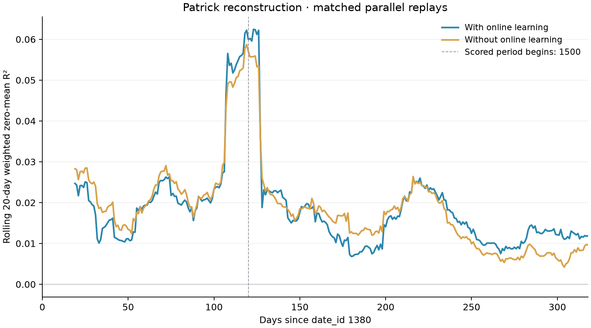

# Patrick 17-seed run

Run `ensemble-20260919T030841Z` was launched on September 18, 2026 (Pacific time).
Follow the [W&B overview](https://wandb.ai/cweill-self/janestreet-repro/runs/ensemble-20260919T030841Z-overview)
or [seed 1's training charts](https://wandb.ai/cweill-self/janestreet-repro/runs/ensemble-20260919T030841Z-seed-01).
The [launch record](references/patrick-ensemble-launch.json) preserves source and
dataset hashes, Modal call IDs, the successful 93-test remote gate, exact L4
recovery rehearsal, and first committed training checkpoint. Deployed training
code is frozen at `e6a2225`; subsequent documentation commits do not change it.

## Completed result

All 17 seeds completed five epochs, and both 319-day replays finished successfully.
Scoring dates 1500–1698 contains 7,397,456 rows with identical target energy in
both modes. Initial ensemble weights match, frozen weights remain unchanged,
and the online replay performed 318 delayed daily updates.

| Model | Frozen R² | Online R² |
|---|---:|---:|
| Original seed 0 | 0.01106254 | 0.01260483 |
| 17-seed ensemble | 0.01412888 | 0.01499967 |

Ensembling adds 0.00306634 frozen R² and 0.00239484 online R². Online learning
adds 0.00087079 within the ensemble. These are fixed-budget local comparisons;
they do not establish the best hyperparameters or reproduce a leaderboard score.
The online/frozen rolling gap varies over time, including periods where updates
hurt despite the positive pooled gain.

Frozen replay took 91.2 minutes; online replay took 207.6 minutes. Both ran in
parallel. These are replay function runtimes, not total experiment wall time.
The run has no remaining training or replay workers.

See the [result record](references/patrick-ensemble-result.json),
[rolling-window data](references/patrick-ensemble-online-learning.csv), and chart:

## Protocol and execution

`configs/patrick_ensemble.yaml` keeps the completed single-seed experiment's model,
five fixed epochs, preprocessing, optimizer settings, and dates. It enables seeds
0–16 and stacked ensemble inference. Seed 0 is reused from the original **offline
initial checkpoint**, after checking it against the completed training checkpoint;
its online-adapted weights are never reused.

The separate Modal app `patrick-seed-ensemble` provides:

1. CPU verification of the original dataset, every cached preparation file, frozen
   preprocessing state, and the archived preparation code. Inference-only source
   changes can reuse the cache only when the preparation definitions and full
   feature modules match the source that produced it.
2. An L4 interruption/recovery rehearsal on three cached training days, requiring
   exactly identical resumed model weights and loss history.
3. Sixteen independent training calls, capped at **four concurrent L4s**. Each seed
   trains from its own initialization and shuffle RNG, saves recovery state every
   25 batches, and has its own W&B run. A retried call resumes that state. Durable
   call ownership prevents different calls from writing the same seed directory.
4. Assembly only after every requested seed has completed all epochs and matches
   the configuration and preprocessing. The initial 17-model artifact is published
   atomically. Frozen replay verifies that **all** member weights stay unchanged.
5. Independent frozen and online L4 replays, followed by the shared-axis 20-day
   rolling plot and pooled scored R². The controller observes durable artifacts;
   training and replay workers remain independent of its lifetime.

Training uses dates 0–1379. Replay begins at 1380; scored evaluation covers
1500–1698 after 120 warmup dates. Online Adam retains separate state per member,
with LR 5e-4, betas (0.8, 0.95), and three steps on the preceding day's newly
released responders. Each member's updates remain sequential. Stacked weights are
refreshed before inference; hidden state is kept per member and symbol.

The original dataset/cache volume is read-only. New state lives in
`janestreet-patrick-ensemble`, under `runs/<run_id>/seeds/<seed>/`, with shared
`launch.json`, `calls.json`, and `status.json`. Final replay artifacts use
`offline/` and `online/`. W&B log files use the separate tracking volume.

Use `train/epoch_mean_unbalanced_loss` and `train/epoch_responder_6_r2` to assess
learning. The balanced optimization loss can remain constant by construction.
Seed 0's historical raw diagnostics are unavailable; its existing run is linked.
The overview run logs ensemble completion and uses separate `online/date_id` and
`offline/date_id` axes for matching calendar dates.

The first seed's checkpoint intervals suggest roughly 5–6 hours for four waves of
offline training, subject to cache verification, Modal capacity, and I/O. Matched replay
adds time and includes daily checkpoint storage excluded from the scaling probe.
No epoch selection or hyperparameter change is made using the scored period.
