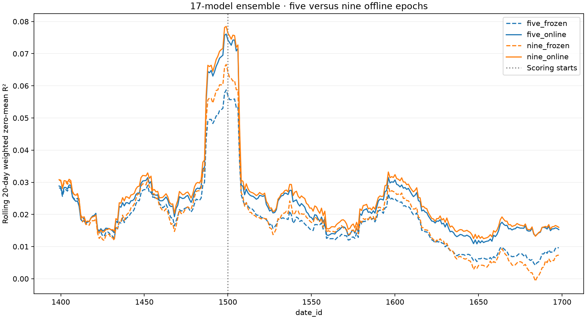

# Nine-epoch 17-model ensemble

This run tests the nine-epoch recipe selected from two three-seed development
splits on the existing later-date evaluation. Online R² improved from seven to
nine epochs on both development windows: 0.02546736 to 0.02568815 on 1180–1379,
and 0.02634289 to 0.02725828 on 980–1179. Nine won all ten 20-day blocks on the
second split. The later evaluation has already been inspected; it is not a pristine
holdout.

| Partition | Dates |
|---|---|
| Offline training and preprocessing fit | 0–1379 |
| Unscored online warmup | 1380–1499 |
| Scored replay | 1500–1698 |

The model, features, offline optimizer, weighting, and seeds 0–16 match the
five-epoch ensemble. Offline training uses nine epochs, LR 5e-4, and fixed epoch
budgets without early stopping. Online learning uses LR 1e-4, three daily Adam
steps, betas (0.8, 0.95), and optimizer state retained across days. Global
normalization is fitted only on the offline training interval. Epoch-level frozen
validation is logged for monitoring; it does not select checkpoints.

## Completed results

Training, both full replays, and the final comparison completed successfully;
results were retrieved on September 24, 2026. All 17 seeds finished nine epochs.
All epoch-five weight controls and the pilot passed. Final pairing verified
identical initial weights for frozen and online replay, matching scored coverage,
unchanged frozen weights, and correct previous-day update timing.

| Configuration | Five epochs | Nine epochs | Nine minus five |
|---|---:|---:|---:|
| Frozen | 0.01412888 | 0.01432650 | +0.00019762 |
| Online, LR 1e-4 | 0.01941540 | **0.02077608** | **+0.00136068** |

Nine epochs improves the online result in all ten nonoverlapping scored blocks:
nine blocks of 20 days and a final block of 19 days. Online learning adds
0.00644958 over the nine-epoch frozen ensemble. All four evaluations cover
7,397,456 scored rows and target energy 10,495,085.4227218.

[Exact results](references/patrick-nine-epoch-ensemble-results.json) ·
[Block scores](references/patrick-nine-epoch-ensemble-scored-blocks.csv) ·
[Rolling curve data](references/patrick-nine-epoch-ensemble-rolling.csv).
These files contain aggregate metrics, not competition rows or model weights.

The frozen replay recorded 4,405.61 seconds (73.4 minutes); online replay recorded
10,887.79 seconds (181.5 minutes). These are replay-function timings, not total
experiment wall time or GPU billing. The controller and seed 10 retried during
execution; checkpoint recovery completed without discarding finished models.
The underlying interruption cause was not established.

The online score is numerically above Patrick's reported 0.02059, but exact
protocol and implementation equivalence remain unconfirmed. The later-date window
was already inspected; this is a matched historical comparison, not an untouched
holdout or evidence of a leaderboard advantage.

## Stages and controls

1. Verify the immutable dataset, source/config identity, causal tests, and existing
   five-epoch baseline. Build one shared training cache and one validation cache.
   The new preprocessing state must exactly match the five-epoch baseline.
2. Train seeds 0–2 from scratch through nine epochs. Every seed's epoch-five
   weights must exactly match its original five-epoch model; preserve epoch-five
   and epoch-nine artifacts. Training checkpoints support interruption recovery.
3. Assemble the three-seed epoch-nine pilot and replay dates 1380–1384 with both
   frozen and online models. This five-day check tests execution and causal
   invariants, not model quality. It requires first-day prediction equality,
   unchanged frozen weights, identical scoring coverage, and four correctly timed
   previous-day online updates. Its diagnostic score does not choose a recipe.
4. Only after the pilot passes, release seeds 3–16 to a pool of at most four L4s.
   Each new seed must pass the same epoch-five weight control.
5. Assemble all 17 nine-epoch models and run two separate full replays, one frozen
   and one online, initialized from the same offline checkpoint. The pilot's online
   state is not reused. Score only dates 1500–1698 and verify pairing/update timing.
6. Compare against the preserved five-epoch results, including pooled R², rolling
   20-day curves and nonoverlapping blocks (the final scored block has 19 days).

The fixed baseline is `ol-followup-20260920T070707Z`: frozen R²
**0.014128878395570421**, online R² **0.019415402177092034**. Both training budgets
must cover identical scored rows and target energy. Baseline models and replay
artifacts are mounted read-only; no historical result is overwritten.

## Execution and tracking

Configuration: `configs/patrick_nine_epoch_ensemble.yaml`.
Launcher: `scripts/modal_nine_epoch_ensemble.py`.
App: `patrick-nine-epoch-ensemble`.
Output volume: `janestreet-patrick-nine-epoch-ensemble`.

The durable controller has a 24-hour timeout. Training jobs checkpoint every
25 training days and at epoch boundaries; replays checkpoint daily. Failed causal,
pairing, or control checks stop progression to later stages. The source archive,
launch identity, call IDs, and stage gates are recorded in the output volume.

Each seed has W&B training and epoch-validation charts. Each pilot/full replay
has its own date-aligned W&B daily, rolling and scored-cumulative R² charts.
Workers retain a compact committed metric prefix and log each new day directly;
the coordinator tracks stage completion and publishes the final comparison plot.
The first replay day's predictions precede any online updates, matching the
five-epoch replay's initial-state policy.

Allow approximately **12–16 hours** including the three-seed pilot training,
remaining seeds in four-worker waves, and full 17-model online replay. Actual time
depends on GPU availability and cache I/O. Peak requested concurrency is four L4s
for training and two L4s for replay; these stages do not overlap.

## Launch

Started September 23, 2026, with source commit
`85b3d2d14362a7962c2822ce6d877cb938b373d4`.

[W&B overview](https://wandb.ai/cweill-self/janestreet-repro/runs/nine-epoch-ensemble-20260923T200241Z-overview) ·
[Launch record](references/patrick-nine-epoch-ensemble-launch.json).

Before launch, 121 tests passed, all four deliberate leakage mutations were
detected, and the full-history secret scan found no leaks.
