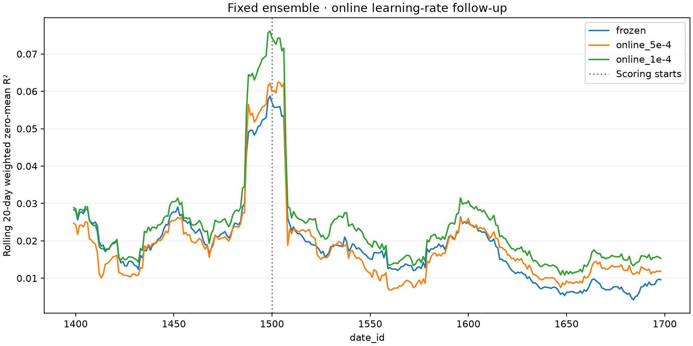

# Fixed 17-model online learning-rate follow-up

The development study favored LR 1e-4 with persistent Adam. This follow-up fixes
that setting and reuses the completed initial ensemble from
`ensemble-20260919T030841Z` (seeds 0–16, five offline epochs, training dates 0–1379).
It changes only online learning rate from 5e-4 to 1e-4. There is no offline training.
Online Adam starts fresh, persists across dates, and retains three update steps,
betas (0.8, 0.95), gradient clipping 1.0 and all nine auxiliary targets.

Replay covers 1380–1698, with warmup 1380–1499 and scoring 1500–1698. This period
has already been inspected; this is follow-up evidence, not an untouched final test.
The completed frozen and 5e-4 runs are reused without rerunning their inference.

`src/online_followup.py` checks the original checkpoint hashes, reference splits,
training boundary, matching baseline identities and immutable checkpoint copies.
The new first day's predictions must exactly match both prior runs before any
online update is allowed. Final comparisons require identical initial tensor hashes,
scored row counts, target energy and date coverage. Tests reject mismatched reference
artifacts, different training boundaries, changed learning-rate identity, altered
first-day predictions and different scored row counts.

`scripts/modal_online_followup.py` deploys an isolated app with read-only source and
original-ensemble volumes. The CPU coordinator runs the causal gate, verifies the
source dataset and caches replay days once. Then **one L4** executes a resumable
online replay with daily checkpoints. No other GPU job is launched. The coordinator
tracks durable calls and logs all three comparisons on explicit date axes in W&B.
The final report contains pooled weighted zero-mean R², changes from both prior
runs, and a three-line 20-day rolling plot. The previous 17-model online replay took
about 3.5 hours; cached input may change runtime, so that is a reference, not an ETA.

App: `patrick-online-followup`. Output volume: `janestreet-patrick-online-followup`.
The existing experiment artifacts and default model configurations remain immutable.

Run `ol-followup-20260920T070707Z` launched from commit `8f2c064` after all 125
local tests passed and all five deliberate leakage mutations were detected.

- [W&B comparison](https://wandb.ai/cweill-self/janestreet-repro/runs/ol-followup-20260920T070707Z)
- [Launch identity and durable controller call](references/patrick-online-followup-launch.json)
- [Modal app](https://modal.com/apps/cweill/main/deployed/patrick-online-followup)

## Completed result

The 17-model replay completed all 319 dates. Both Modal and W&B report completion,
and no Modal containers remained active when checked. All comparisons share the
same initial tensor fingerprint, 7,397,456 scored rows and weighted target energy
10,495,085.4227218. Both online versions recorded 318 correctly delayed updates.

| Setting | Pooled R² on dates 1500–1698 |
|---|---:|
| Frozen | 0.01412888 |
| Online 5e-4 | 0.01499967 |
| Online 1e-4 | **0.01941540** |

Lowering the learning rate adds **0.00441573 R²** relative to the previous online
run. The new online improvement over frozen is **0.00528652 R²**. The replay took
11,665 seconds (194.4 minutes). The rolling plot shows improvement across much of
the scored interval, including the late decline in frozen performance.

This strengthens the evidence that the original online learning rate was too large
for this reconstruction. It does not establish a globally optimal learning rate or
reproduce Patrick's exact score. The interval was previously inspected.

- [Verified result summary](references/patrick-online-followup-result.json)
- [Rolling data](references/patrick-online-followup-comparison.csv)

