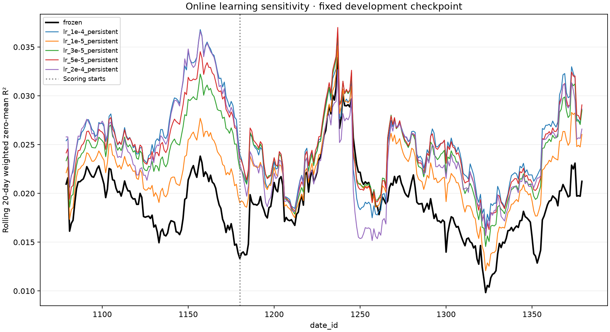

# Lower-rate development refinement

This study adds four persistent-Adam online learning rates: **1e-5, 3e-5, 5e-5,
and 2e-4**. It reuses the three-seed initial checkpoint, cached replay days, frozen
baseline and completed persistent-Adam 1e-4 result from
`ol-sweep-20260919T194601Z`. There is no offline retraining and no baseline rerun.

All settings other than learning rate stay fixed: seeds 0–2, five offline epochs,
training dates 0–1059, replay 1060–1379, scored dates 1180–1379, three online steps,
betas (0.8, 0.95), clipping 1.0, and all nine targets. Each new replay starts with a
fresh online optimizer and updates only after previous-day labels are released.

The isolated `patrick-online-refinement` Modal app mounts the original study volume
read-only. Its CPU coordinator runs the causal gate, verifies cache checksums,
checks that the model/data/update implementation and dependency lock match the
original source archive, and validates both reused reference results. The new
report records each trial's actual provenance; reused identities are not rewritten.
The summary API accepts an explicit expected provenance per trial while retaining
the stricter same-provenance default used by existing studies.

Four independent L4 jobs perform the new replays, with day-boundary checkpoints,
durable call IDs and retries. Each first day's predictions must exactly match the
reused frozen baseline before adaptation can continue. The separate 17-model
follow-up remains unchanged; if still running, total concurrency can reach five GPUs.

W&B reports all six curves on explicit date axes and pooled weighted zero-mean R².
The final report also includes **ten non-overlapping 20-day scored blocks**, each
with R² and its difference from frozen. Blocks use evaluator-owned primary scoring
statistics and require matching row counts and target energy for every date.
Block diagnostics do not replace the pooled metric or provide independent samples
for a formal significance claim.

This is an adaptive development search prompted by the first sweep. It does not
create an untouched test set, change defaults, or automatically launch a winner.
The earlier development online replays took roughly 92–115 minutes each; the four
new jobs run concurrently, subject to GPU availability and verification overhead.

Implementation: `src/online_refinement.py`, `src/online_sweep.py` and
`scripts/modal_online_refinement.py`. Output volume:
`janestreet-patrick-online-refinement`.

Run `ol-refine-20260920T075437Z` launched from commit `2cb18ef`. Before launch,
all 126 local tests passed, all five leakage mutations were detected, and the
original archived runtime matched all 27 checked files and five replay definitions.
The remote causal gate passed 107 tests and CI passed. All four GPU workers started,
passed exact first-day parity against the reused frozen run on date 1060, and had
completed 1–3 replay days at the initial check. Final results are recorded below.

- [W&B overview](https://wandb.ai/cweill-self/janestreet-repro/runs/ol-refine-20260920T075437Z-overview)
- [Launch identity and durable controller call](references/patrick-online-refinement-launch.json)
- [Modal app](https://modal.com/apps/cweill/main/deployed/patrick-online-refinement)

## Completed results

All four new replays completed all 320 dates; the coordinator and W&B report
completion. No Modal containers remained active when checked. Scoring uses dates
1180–1379, with the fixed three-model ensemble.

| Online LR | Pooled R² | Gain over frozen | Positive 20-day blocks |
|---|---:|---:|---:|
| Frozen | 0.01935094 | +0.00000000 | 0/10 |
| 1e-05 | 0.02194147 | +0.00259053 | 9/10 |
| 3e-05 | 0.02355156 | +0.00420062 | 10/10 |
| 5e-05 | 0.02406497 | +0.00471403 | 10/10 |
| 1e-04 | 0.02405157 | +0.00470063 | 9/10 |
| 2e-04 | 0.02261735 | +0.00326641 | 8/10 |

The highest pooled score is 0.02406497 at 5e-5, only **0.00001340 R²** above
1e-4. Those rates each win five of the ten blocks in a direct comparison. The
5e-5 rate beats frozen in all ten blocks; 1e-4 does so in nine. This supports a
promising range around 5e-5–1e-4, rather than a precisely established optimum.
No formal statistical significance claim follows from these block counts.

The four new replay workers took 90.7–124.5 minutes each. The 17-model follow-up
separately confirms a material benefit at 1e-4 on the later interval. A 17-model
5e-5 result is not available. No defaults were changed and no further runs launched.

- [Complete numerical results](references/patrick-online-refinement-result.json)
- [Scored-block diagnostics](references/patrick-online-refinement-blocks.csv)
- [Rolling data](references/patrick-online-refinement-rolling.csv)

