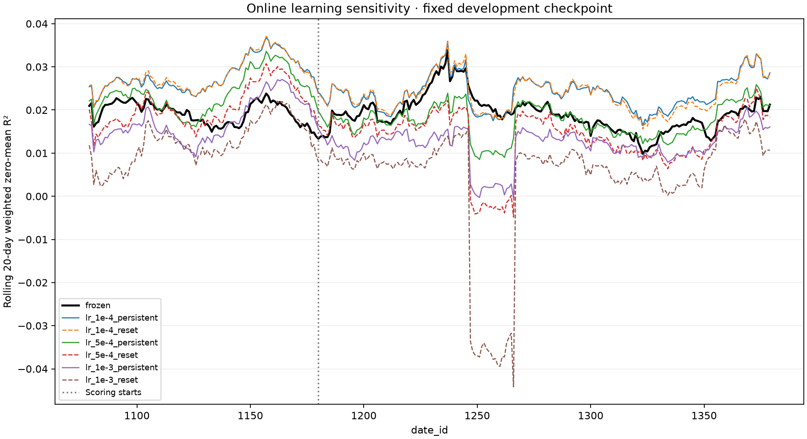

# Patrick online-learning sensitivity study

The completed 17-seed comparison scored 0.01412888 frozen and 0.01499967 online
(gain 0.00087079). This study tests whether learning rate or Adam state persistence
explains the modest benefit. It does not assume hyperparameters are the cause:
reconstruction differences, offline fit and market regime remain alternatives.

## Predeclared design

- Train fresh seeds 0, 1 and 2 for five fixed epochs on dates **0–1059**.
- Fit normalization only on those training dates. Existing models trained through
  1379 cannot be reused for this comparison.
- Replay **1060–1379**. The first 120 dates are online warmup; score **1180–1379**.
- Log frozen responder-6 validation R² after each training epoch on 1180–1379.
  These are development observations, not independent test estimates. Always use
  epoch five for this study; no early stopping or epoch selection.
- Assemble the same three initial models for every trial. Hold all other settings
  fixed, including all nine target weights, three daily update steps, Adam betas
  `(0.8, 0.95)` and gradient clipping at 1.0.

| Trial | Online learning rate | Online Adam state |
|---|---:|---|
| frozen | — | no updates |
| lr_1e-4_persistent | 0.0001 | persists across dates |
| lr_1e-4_reset | 0.0001 | reset before each daily update |
| lr_5e-4_persistent | 0.0005 | persists across dates |
| lr_5e-4_reset | 0.0005 | reset before each daily update |
| lr_1e-3_persistent | 0.001 | persists across dates |
| lr_1e-3_reset | 0.001 | reset before each daily update |

Both online policies begin with fresh optimizers, never the offline Adam state.
The current production assumption is persistent online Adam with LR 5e-4.
The first replay date has no buffered previous-day features, so its predictions
must match frozen predictions exactly. Subsequent updates train only on buffered
features after the API releases their previous-day responders.

Report every trial's pooled weighted zero-mean R², difference from frozen, runtime,
and 20-day rolling curve. Daily ratios are not averaged to compute pooled scores.
No trial is automatically promoted to the previously inspected 1380–1698 replay.
This is a small development sensitivity study, not proof of generalization or an
exhaustive search over all plausible online settings.

## Execution and monitoring

`configs/patrick_ol_sweep.yaml` defines the fixed training configuration.
`src/online_sweep.py` defines the seven trials, verified daily cache, immutable
initial checkpoint copies, paired-result checks and comparison artifacts.
`scripts/modal_online_sweep.py` deploys the isolated `patrick-ol-sweep` app.

The durable coordinator runs the causal suite and verifies the source dataset on
CPU, then prepares shared training, replay and frozen-validation caches once.
A short L4 rehearsal must pass exact interrupted-training recovery and full-day
versus streaming validation parity before full training begins.

At most **three L4 GPUs train concurrently**, then at most **four L4 GPUs replay**.
Training checkpoints every 25 batches and at epoch boundaries; replay checkpoints
at day boundaries. Retries adopt durable calls and validate code, configuration,
data and checkpoint identities. Source data mounts read-only. GPU containers scale
down after use. This worker saves final models and resumable training checkpoints;
it logs epoch validation but does not archive every epoch's model separately.

W&B project: `cweill-self/janestreet-repro`. Each seed has its own training run;
the overview logs each trial's daily, scored cumulative and rolling R²
against its own explicit `date_id` axis. The final overview includes a seven-curve
plot and complete result table. Output volume: `janestreet-patrick-ol-sweep`.

Tests cover unchanged initial weights and first-day predictions, delayed update
timing, frozen weights, daily-reset behavior, resume equivalence under future-label
poisoning, rejected leaked training boundaries, cache corruption/source changes,
and mismatched comparison provenance. These supplement the existing causal tests.

## Launch record

Run `ol-sweep-20260919T194601Z` was launched from commit `cfdecf6` after 123 local
tests passed and all five deliberate leakage mutations were detected. The initial
observed phase was CPU preparation; the complete results are recorded below.
The deployed causal gate subsequently passed all 104 selected tests in 55 seconds
with the exact launch source hash. A later import-formatting/ruff-classification
fix on `main` is not redeployed into this immutable run.

- [W&B overview](https://wandb.ai/cweill-self/janestreet-repro/runs/ol-sweep-20260919T194601Z-overview)
- [Modal app](https://modal.com/apps/cweill/main/deployed/patrick-ol-sweep)
- [Immutable launch identity and durable call IDs](references/patrick-online-sensitivity-launch.json)

## Completed results

All three seeds completed five epochs, and all seven trials completed the 320-day
replay. Scoring covers dates 1180–1379 (200 dates). The coordinator and W&B run
finished successfully; no Modal containers remained active when checked.

| Trial | Pooled R² | Difference from frozen |
|---|---:|---:|
| frozen | 0.01935094 | +0.00000000 |
| lr_1e-4_persistent | 0.02405157 | +0.00470063 |
| lr_1e-4_reset | 0.02395300 | +0.00460206 |
| lr_5e-4_persistent | 0.01763681 | -0.00171413 |
| lr_5e-4_reset | 0.01445205 | -0.00489889 |
| lr_1e-3_persistent | 0.01243798 | -0.00691296 |
| lr_1e-3_reset | 0.00595689 | -0.01339405 |

All trials have identical initial tensor fingerprints, 7,457,472 scored rows and
weighted target energy 10,547,832.643854462. Each online trial recorded 319 delayed
daily updates; frozen recorded zero. The GPU recovery/parity rehearsal passed.
Training took 47.8–52.2 minutes per seed; replay workers took 91.2–114.9 minutes
each. These concurrent-worker runtimes are not a controlled inference speed benchmark.

The 1e-4 learning rate improves pooled R² by 0.00470063 with persistent Adam and
0.00460206 with daily resets. At that learning rate the reset-policy difference is
only 0.00009857. Both larger learning rates underperform frozen on this split.
The plot shows the low-rate benefit across much of the scored period, with a short
interval around dates 1250–1265 where its rolling score is slightly below frozen.

This supports learning-rate sensitivity in this reconstruction. It does not establish
that 1e-4 generalizes to later dates, reproduce Patrick's private score, or isolate
all other architecture/training differences. No follow-up GPU run was launched and
no default configuration was changed. A next experiment can fix 1e-4 with persistent
Adam and reuse the existing later-period ensemble checkpoint for a comparison on
1500–1698; that interval has already been inspected, so it is follow-up evidence,
not an untouched final test.

- [Complete numerical results](references/patrick-online-sensitivity-result.json)
- [Rolling values](references/patrick-online-sensitivity-rolling.csv)

