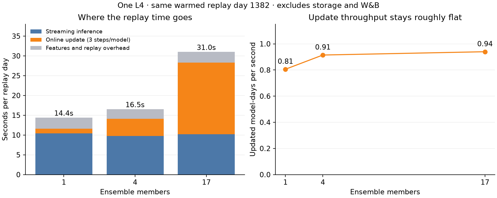

# Measuring Patrick ensemble throughput

## Results

The [recorded L4 run](references/patrick-scaling-profile.json) passed, including
exact neutrality checks for both timing and tracing. The same warmed date (1382),
with Adam state already initialized, gives:

| Models | Total replay/day | Online update/day | Streaming inference/day | Updated model-days/s | Optimizer steps/s |
| --- | ---: | ---: | ---: | ---: | ---: |
| 1 | 14.40 s | 1.24 s | 10.39 s | 0.81 | 2.42 |
| 4 | 16.54 s | 4.37 s | 9.73 s | 0.91 | 2.74 |
| 17 | 31.01 s | 18.09 s | 10.20 s | 0.94 | 2.82 |



Streaming inference dominates the one-model replay; updates are only 8.6% of that
day. At 17 models, updates are 58.3% of the day. Total replay takes 2.15 times as
long for 17 models, while streaming inference remains roughly constant. Online
updates scale nearly linearly after shared costs are amortized: each member costs
about 1.06 seconds for three steps at 17 members. This is sequential update
throughput on one GPU, not a benchmark of batched training or multiple GPUs.

The traced one-model update took 1.543 s. Its CPU phase durations (elapsed time
inside the calls, including waits) were:

| Phase | Three-step update total |
| --- | ---: |
| Panel preparation | 241 ms |
| Forward passes | 464 ms |
| Loss calculation | 13 ms |
| Backward passes | 688 ms |
| Gradient clipping | 14 ms |
| Adam `step` calls | 26 ms |

Adam itself is a small part of the update. The trace contains many small cuDNN GRU
kernels: for example, an individual recurrent kernel appears 23,232 times
(968 timestamps × 8 layers × 3 steps). Actual GPU kernel intervals cover 0.915 s,
or 59.3% of the profiled wall time. Together with launch activity, this suggests
launch overhead and CPU work deserve investigation; it does **not** establish
that the GPU is saturated. Profiler overhead and first-update preparation inflate
some timings, so these phase figures must not replace the normal replay timings.
GPU range annotations overlap and backward work can be attributed asynchronously;
do not sum the trace's named GPU phase totals or mistake CPU elapsed time for
CPU computation. The kernel-active fraction uses the union of physical kernel
intervals.

The next training experiment should compare the current sequential updates with
two independent models updated together, measuring optimizer steps per second,
memory, and unchanged per-model updates. The current profile cannot establish how
much that would help. Improving one-model replay calls for an inference trace
first, because timestamp processing is its larger cost.

The full suite passed 109 tests and [CI passed](https://github.com/cweill/jane-street-causal-forecasting/actions/runs/35407046190).
The remote safety gate and local source fingerprint match. The compressed Chrome
trace is saved on `janestreet-replay-acceleration` at
`scaling-profiles/scaling-20260918T234742Z/online_update_trace.json.gz`.

## Method

The 17-member inference benchmark does not establish the bottleneck of a whole
replay day or offline training. This probe separates the existing execution path
into measured phases before extrapolating ensemble runtime.

`scripts/modal_scaling_profile.py` uses one L4, four CPU cores, and the immutable
five-epoch checkpoint. It runs 1, 4, and 17 distinct perturbed checkpoint copies
through dates 1380–1382, with stacked inference and the real online update code.
The first day fills the public-input cache; dates 1381 and 1382 each have one
eligible update of three Adam steps per member. No additional seeds are trained
offline, and this is not an accuracy experiment.

For each ensemble size, the median over the two eligible days records:

- Total replay wall time, measured with GPU synchronization at day boundaries.
- Online update time, including panel preparation, transfers, forward/backward,
  clipping, Adam, and optimizer initialization where applicable.
- Panel preparation, a **subset** of online update time.
- Streaming inference time, including state-bank handling, input transfers,
  ensemble prediction, averaging, and the existing synchronized output copy.
- Weight stacking, a **subset** of inference time.
- Public feature transformation outside online updates.
- Remaining replay time: validation, row ordering, simulator bookkeeping, scoring,
  and other Python overhead.

Do not add the nested panel and stacking measurements to their parent times again.
The resident three-day source excludes Parquet I/O after initial loading, checkpoint
storage, volume commits during a replay day, and W&B. The first of the two update
days initializes Adam state; the second reuses it. Two days provide a bounded
scaling probe, not a distribution of runtimes over the full competition history.

Useful units are:

```text
seconds per updated model-day = online update seconds / model count
updated model-days per second = model count / online update seconds
optimizer steps per second = 3 * model count / online update seconds
```

An updated model-day means three steps on one released day, not a fully trained
model. Flat model-days/second as ensemble size grows indicates approximately
linear cost in this sequential implementation. Growing throughput indicates
amortized overhead or improved utilization; it does not alone identify the cause.

A separate `torch.profiler` trace labels the actual forward, loss, backward,
clipping, and Adam calls for one real update. It records operator CPU/GPU times and
the union of GPU kernel intervals. This trace is excluded from the throughput
table because profiling adds overhead. Kernel-active fraction measures time
coverage, not SM occupancy or tensor-core utilization. CPU synchronization time
can be waiting for GPU work; it should not be interpreted as CPU computation.

The probe uses the existing training precision policy: highest matmul precision,
cuDNN TF32 enabled. Timed replay and detailed tracing are each checked against an
uninstrumented reference for exactly identical predictions, weights, and Adam
state. The local neutrality test is also part of the mandatory safety gate.

The source volume is read-only, output paths are exclusive to this profiling job,
and existing evaluation deployments are not modified.
