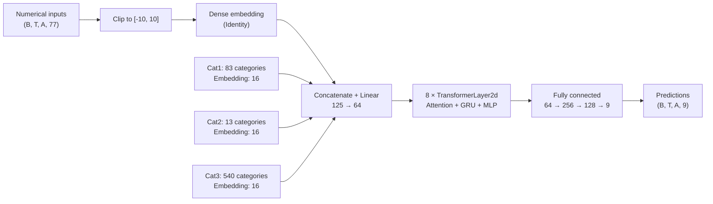

# Patrick Yam: architecture transcribed from slide 19

Source: [author's presentation, slide 19](https://drive.google.com/file/d/1AdzXrOZN699SGHAyb32slLBkEMxBCYiJ/view).
The user supplied a screenshot; labels were checked against the higher-resolution PDF
on 2026-09-17.



`B` denotes batch size, `T` time steps, and `A` assets/symbols. The concatenated
width `125 = 77 + 3 × 16` is derived; the slide labels the projection's output
`d_model=64`. Cardinalities are transcribed from the parenthesized Cat1–Cat3 labels;
the actual input-column mapping and unknown-category handling are not shown.

This slide does not specify the attention head count, GRU hidden size, dropout,
head activation functions, or normalization details. Model width 64 does not
establish GRU hidden width because the method has a separate temporal multiplier.

## Block implementation: slide 22

The second user screenshot, checked against PDF slide 22, shows the following code.
Whitespace is normalized. This is a source transcription, not an executable model in
the harness: the custom `GLUact` definition and final constructor arguments are absent.

```python
class TransformerLayer2d(nn.Module):
    def __init__(
        self,
        d_model,
        nheads,
        d_hidden,
        dropout=0.0,
        rnn_multiplier=1,
        activation=GLUact(nn.GELU()),
        norm=nn.LayerNorm,
    ):
        super().__init__()
        self.norm1 = norm(d_model)
        self.attn1 = nn.MultiheadAttention(d_model, nheads, dropout, batch_first=True)

        self.norm2 = norm(d_model)
        self.rnn2 = nn.GRU(d_model, rnn_multiplier * d_model, 1, batch_first=True)
        self.post_rnn = nn.Linear(rnn_multiplier * d_model, d_model)

        self.norm3 = norm(d_model)
        self.ffn3 = nn.Sequential(
            nn.Linear(d_model, d_hidden),
            activation,
            nn.Dropout(dropout),
            nn.Linear(d_hidden // 2, d_model),
            nn.Dropout(dropout),
        )

    def forward(self, x):
        B, T, A, D = x.shape
        x2 = self.norm1(x)
        x2 = rearrange(x2, "b t a d -> (b t) a d")
        x2 = self.attn1(x2, x2, x2)[0]
        x2 = rearrange(x2, "(b t) a d -> b t a d", b=B)
        x = x + x2

        x2 = self.norm2(x)
        x2 = rearrange(x2, "b t a d -> (b a) t d")
        x2 = self.rnn2(x2)[0]
        x2 = rearrange(x2, "(b a) t d -> b t a d", b=B)
        x2 = self.post_rnn(x2)
        x = x + x2

        x2 = self.norm3(x)
        x2 = self.ffn3(x2)
        x = x + x2
        return x
```

The block has three pre-normalized residual branches:

1. Self-attention across assets at each timestamp: `(B*T, A, D)`.
2. A one-layer GRU along time independently per asset: `(B*A, T, D)`.
   Its hidden width is `rnn_multiplier * D`, projected back to `D` afterward.
3. A feed-forward network: `D -> d_hidden -> GLUact(GELU) -> d_hidden/2 -> D`,
   with dropout after the activation and final linear layer.

The constructor defaults are `dropout=0.0`, `rnn_multiplier=1`,
`activation=GLUact(nn.GELU())`, and `norm=nn.LayerNorm`. These defaults do not establish
the trained model's values. `nheads` and `d_hidden` have no defaults in this screenshot.
The GLU width reduction follows from the next linear layer's `d_hidden//2` input;
the precise gating formula still needs the custom `GLUact` source.

This whole-sequence forward method shows no missing-asset mask or inference state cache.
Those behaviors cannot be recovered from this snippet alone. The attention axis is
current-timestamp assets; the unidirectional GRU supplies causal temporal mixing.

## Displayed configuration: slide 28

Transcribed from the next user screenshot and checked against PDF slide 28.
This is the configuration displayed in the talk; it has not been matched to a
released executable checkpoint. Comments after the optimizer betas are preserved.

```python
params = {
    "d_model": 64,
    "d_dense": 64,
    "d_hidden": 1024,
    "d_cat": 16,
    "use_cat": True,
    "standardize_input": False,
    "clip_input": True,
    "use_input_norm": False,
    "input_layer_type": "none",
    "d_num_emb": 4,
    "d_group": 16,
    "n_encoder_layers": 8,
    "nheads": 8,
    "dropout": 0.0,
    "rnn_multiplier": 4,
    "encoder_rnn_type": "gru",
    "xsection_mixer": "attn",
    "ff_type": "mlp",
    "use_post_norm": False,
    "activation": "silu",
    "norm_type": "RMSNorm",
    "optimizer": "AdamW",
    "beta1": 0.95,  # 0.9,
    "beta2": 0.9999,  # 0.999,
    "use_scheduler": False,
    "accumulate_grad_batches": 1,
    "NUM_FEATURES": 77,
    "NUM_OUTPUTS": 9,
    "lr": 5e-4,
    "wd": 1e-4,
    "target_weight": [1, 1, 1, 6, 2, 2, 12, 5, 5],
    "feature_group": feature_group,
}
```

Together with slide 22, these values imply GRU hidden width `4*64=256`, projected
back to 64, and eight attention heads with width `64/8=8` each. If the displayed
block's gated feed-forward wiring is retained, its widths are `64 -> 1024 -> 512 -> 64`.
The configuration's `silu` and `RMSNorm` differ from the block constructor defaults
`GLUact(nn.GELU())` and `LayerNorm`. The model factory is still needed to establish
how the activation string selects or wraps the gating operation.

`standardize_input=False` does not establish that preprocessing is absent: the talk
separately describes training-fitted global standardization. Likewise, parameters
such as `d_dense`, `d_num_emb`, and `d_group` may be inactive under
`input_layer_type="none"`; their use cannot be inferred from their presence alone.
The list of target weights is visible, but output-column ordering must be verified
in code before binding each weight to a responder.

## Training sample multiplier: slide 27

The slide states that all training samples are used, with recency multiplier
`(200 + date_id) / (200 + max_date_id)` and an additional factor 1.5 when sequence
length is 968. For local CV, `max_date_id` must use only that fold's offline training
dates. The screenshot does not specify the exact code combining this multiplier
with the competition's row weights or whether sequence length is measured per
asset or per day. Evaluation always uses the original competition weights.
